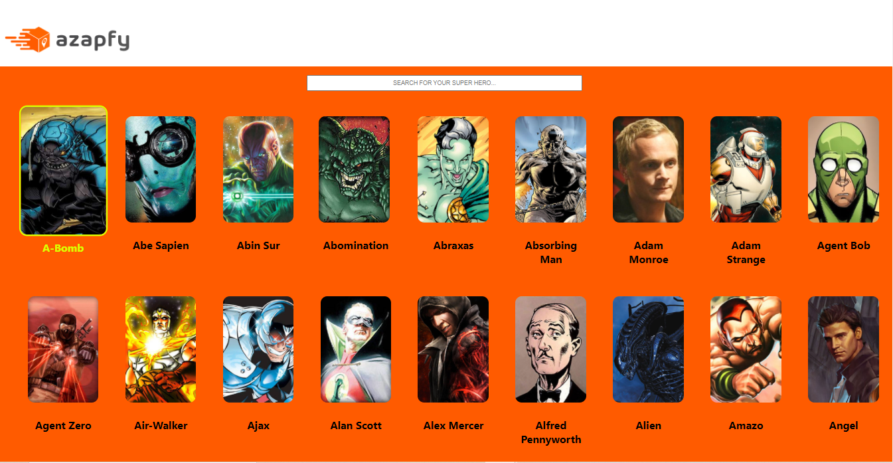

<h1 align="center">
    
</h1>

<p align="center">
  <a href="#-technologies">Technologies</a>&nbsp;&nbsp;&nbsp;|&nbsp;&nbsp;&nbsp;
  <a href="#-layout">Getting started</a>&nbsp;&nbsp;&nbsp;|&nbsp;&nbsp;&nbsp;
  <a href="#-project">Project</a>&nbsp;&nbsp;&nbsp;|&nbsp;&nbsp;&nbsp;
  <a href="#-license">License</a>
</p>

<p align="center">
  
  
  

  
</p>

<br>

<p align="center">
  
</p>

                                                                        
*******************************************************************************************************************************************************************************
                                                                                        
                                                       ### 🎲 Rodando o Back End (servidor)

-> Devido a hospedagem da API, utilizada no projeto , ser realizada sem SSL (certificado de autenticação em um website / http) foi necessário a utilização do recurso da hospedagem do projeto em um servidor temporário. Para que se consiga acessasr ao link gerado pelo GITHUB PAGES é necessário realizar o seguinte passo a passo: 

• Desativar o CORS através do seguinte link: http://cors-anywhere.herokuapp.com/corsdemo </br>
• Acessar o site através da url a seguir: https://maarvins.github.io/azap-app/

*******************************************************************************************************************************************************************************

## 🧪 Technologies

This project was developed using the following technologies:

- [Javascript.js](https://www.javascript.com/)
- [React](https://reactjs.org)
- [Axios](https://axios-http.com/docs/intro)
- [Styled-Components](https://styled-components.com/)

## 🚀 Getting started

Clone the project and access the folder.

```bash
$ git clone https://github.com/maarvins/azap-app.git && cd azap-app
```

Follow the steps below

```bash
# Install the dependencies
$ npm install


# Start the project
$ npm start
```

## 💻 Project

The idea behind this project is a test for a intern job and this is my biggest experience as a developer!

## 📝 License

This project is licensed under the MIT License. See the [LICENSE](LICENSE.md) file for details.

---

<p align="center">Made with ❤️ by Marcus Sena</p>
